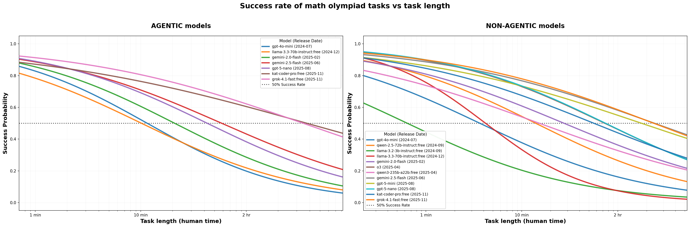
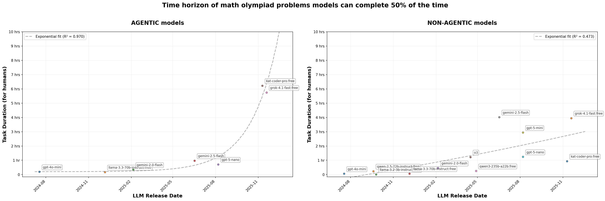
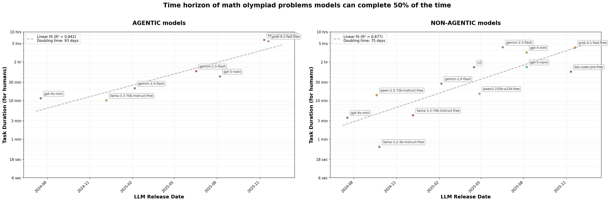

# MEASURING AI CAPABILITY ON OLYMPIAD-STYLE MATHEMATICS REASONING TASKS

## Students (McGill University)
- Miguel Carrillo Cobián ( miguel.carrillocobian@mail.mcgill.ca )
- De-Jhong Hsu ( de-jhong.hsu@mail.mcgill.ca )
- Tong Wu ( tong.wu7@mail.mcgill.ca )

## Mentors (Mila - Quebec AI Institute)
- Jay Gala ( jay.gala@mila.quebec )
- Fengyuan Liu ( fengyuan.liu@mila.quebec )

## Overview

This project extends the METR's work to evaluate AI capabilities on Olympiad-level mathematics reasoning tasks. Building on recent work by METR Kwa et al. (2025), we measure the **task-completion time horizon**—the longest human-duration task an AI can complete with a fixed success probability—as a metric of AI capability growth in mathematical reasoning domains.

Unlike previous METR work that focused primarily on software engineering tasks, this project evaluates how well large language models (LLMs) perform on challenging mathematical problems from various Olympiad competitions, including:
- English Olympiad Mathematics
- Chinese Olympiad Mathematics  
- English Olympiad Physics
- Gaokao Mathematics and Physics

We test both **agentic** (models that can use tools and take multiple steps) and **non-agentic** (single-pass) model configurations to understand how different interaction paradigms affect mathematical reasoning capabilities.

## Motivation

Recent work by METR Kwa et al. (2025) discusses the task-completion time horizon as a metric of AI capability growth. They found that over six years, this horizon has grown exponentially in software domains. However, this progress has been measured almost entirely in programming tasks. To address this gap, we measure AI performance on Olympiad-level mathematics reasoning, mapping success to human-equivalent time, to test if the same scaling law holds beyond programming tasks.

## Key Findings

### Exponential Growth in Time Horizons

Our analysis reveals that AI capabilities on mathematical reasoning tasks follow a similar exponential growth pattern as observed in software engineering domains. The time horizon—measured as the task duration (in human minutes) at which models achieve 50% success rate—has been increasing exponentially over time.

**Results:**

- **Agentic models** show faster growth rates, with newer models capable of solving problems that would take humans significantly longer
- **Non-agentic models** show linear improvement,  generally with lower absolute time horizons
- The growth follows a **log-linear** relationship, indicating consistent exponential scaling

### Success Rate vs Task Length

Models exhibit a logistic relationship between success probability and task complexity (measured in human time). This allows us to:
- Fit logistic models to each model's performance
- Extract the 50% success threshold (time horizon) for each model
- Compare capabilities across different model architectures and release dates

### Model Performance Trends

Our evaluation includes models from 2024-2025, spanning:
- GPT-4o Mini, GPT-5 Nano, GPT-5 Mini, GPT-5.1
- Gemini 2.0 Flash, Gemini 2.5 Flash, Gemini 2.5 Pro, Gemini 3 Pro Preview
- Llama 3.2, Llama 3.3
- Qwen2.5, Qwen3
- o3, KAT-Coder-Pro, Grok 4.1 Fast

Results show consistent improvement in mathematical reasoning capabilities, with newer models achieving higher time horizons.

## Plots

The project includes visualizations in `math_olympiad_analysis/plots/`:

### Success Rate vs Task Length
- **`success_rate_vs_task_length.png`**: Combined view of all models showing logistic curves
- **`success_rate_vs_task_length_agentic.png`**: Agentic models only  
- **`success_rate_vs_task_length_non-agentic.png`**: Non-agentic models only

These plots show how success probability decreases as task complexity (human time) increases, with fitted logistic curves for each model. Each curve represents a different model, showing the relationship between problem difficulty (measured in human minutes) and the model's success rate.

### Time Horizon vs Release Date
- **`time_horizon_vs_release_date.png`**: Combined exponential growth trends
- **`time_horizon_vs_release_date_log_linear.png`**: Log-linear scale showing exponential growth with doubling time calculations
- **`time_horizon_vs_release_date_agentic.png`**: Agentic models growth trend
- **`time_horizon_vs_release_date_non-agentic.png`**: Non-agentic models growth trend

These plots demonstrate the exponential growth in AI capabilities over time, with fitted curves showing doubling times and growth rates. The time horizon represents the task duration (in human minutes) at which models achieve 50% success probability.

### Time Horizon vs Release Date (Log-Linear Scale)

The log-linear visualization provides a clearer view of the exponential growth pattern by plotting time horizons on a logarithmic scale:

**Insights from Log-Linear Analysis:**

- **Agentic Models**: 
  - Strong exponential fit with R² = 0.842
  - Doubling time: **93 days** (capabilities double every ~3 months)
  - Higher absolute performance: Latest models (e.g., Grok 4.1 Fast) can solve problems requiring up to **6 hours** of human time
  - More consistent growth pattern with less variability

- **Non-Agentic Models**:
  - Exponential fit with R² = 0.677
  - Faster doubling time: **75 days** (capabilities double every ~2.5 months)
  - Lower absolute performance: Best models reach approximately **1 hour** of human time
  - Higher variability in performance across models

**Comparison:**

- Agentic models show **stronger correlation** (higher R²) but **slower growth rate** (longer doubling time)
- Non-agentic models show **faster growth rate** (shorter doubling time) but **more variability** (lower R²)
- Agentic approaches enable models to tackle **significantly longer and more complex problems** (6 hours vs 1 hour), suggesting that tool use and multi-step reasoning provide substantial advantages for mathematical reasoning tasks
